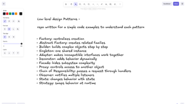

# Detailed Code Explanation for Each Design Pattern


---

# 1. Factory Pattern

## Pattern name
Factory Pattern

## What problem does it solve?
Suppose your application needs to create different objects like email, SMS, or push notifications. If you create them directly with `new` all over the code, then your client code becomes tightly coupled to concrete classes.

That means:
- your code becomes harder to change
- new types become difficult to add
- logic is repeated in many places

## What is the idea behind this pattern?
Create a separate class called a factory whose only responsibility is to create the right object based on input.

The client asks the factory for an object, and the factory decides which class to instantiate.

## Code structure in this project
Files involved:
- `CoreDesignPattern/Creational/Factory/Main.java`
- `CoreDesignPattern/Creational/Factory/NotificationFactory.java`
- `CoreDesignPattern/Creational/Factory/Notification.java`
- `CoreDesignPattern/Creational/Factory/EmailNotification.java`
- `CoreDesignPattern/Creational/Factory/SMSNotification.java`
- `CoreDesignPattern/Creational/Factory/PushNotification.java`
- `CoreDesignPattern/Creational/Factory/NotificationType.java`

## Class-by-class explanation

### 1) `Notification.java`
This is the common interface.

It declares a method like:
- `send(String receiver, String message)`

This means every notification type must implement the same method.

So the client can treat all notifications in the same way, even if their internal implementation is different.

### 2) `EmailNotification.java`
This class implements `Notification`.

Its `send()` method probably sends an email message.

The important point is that the client does not need to know how email sending works. It only calls `send()`.

### 3) `SMSNotification.java`
This class also implements `Notification`, but its `send()` method sends SMS.

### 4) `PushNotification.java`
This class implements the same interface, but sends a push notification to a device.

### 5) `NotificationType.java`
This enum defines the different types of notifications:
- EMAIL
- SMS
- PUSH

This gives clean input to the factory.

### 6) `NotificationFactory.java`
This is the most important class in this pattern.

Its method is:

```java
public static Notification create(NotificationType type)
```

This method checks the input type and returns the correct object:

```java
case EMAIL -> new EmailNotification();
case SMS -> new SMSNotification();
case PUSH -> new PushNotification();
```

So the factory is essentially a decision-maker.

### 7) `Main.java`
This class is the client.

The client does this:

```java
Notification n1 = NotificationFactory.create(NotificationType.EMAIL);
n1.send("user@example.com", "Your order shipped!");
```

This means the client is not doing the object creation itself.

The client only says: "create an email notification for me".

The factory does the actual object creation.

## What the code is doing step by step

1. `Main` chooses `NotificationType.EMAIL`
2. It passes that value to `NotificationFactory.create(type)`
3. The factory sees `EMAIL`
4. The factory returns a new `EmailNotification`
5. `Main` stores it in a `Notification` variable
6. `Main` calls `send()` on that object
7. The email notification sends the message

The same pattern happens for SMS and push.

## Why is this better than direct `new`?
Because now the client code only depends on the interface `Notification`.

If tomorrow we add `WhatsAppNotification`, we change only the factory.

The client code does not need to change.

## Deep transcript you can say in an interview

"In this example, the client does not directly create email, SMS, or push notification objects. Instead, it calls `NotificationFactory.create(type)`. The factory receives the request type and decides which implementation object should be returned. This is the core idea of Factory Pattern. By moving creation logic into one place, we reduce duplicate code, keep the client simple, and make future extension easy. If a new notification type is added later, only the factory needs to be updated."

## Flow

```text
Client --> NotificationFactory.create(type)
                    |
                    +--> EMAIL --> EmailNotification
                    +--> SMS --> SMSNotification
                    +--> PUSH --> PushNotification
```

---

# 2. Abstract Factory Pattern

## Pattern name
Abstract Factory Pattern

## What problem does it solve?
Sometimes you do not need one object. You need a family of related objects that must work together.

Example:
- a chair and a sofa should belong to the same style
- modern chair + modern sofa
- Victorian chair + Victorian sofa

If you create them separately, you may accidentally mix styles.

## What is the idea behind this pattern?
Instead of creating one product at a time, create an entire family of related products through one factory interface.

## Code structure in this project
Files involved:
- `CoreDesignPattern/Creational/AbstractFactory/AbstractFactoryDemo.java`

## Class-by-class explanation

### 1) `Chair`
This is the interface for chair products.

It declares one method:
- `sitOn()`

### 2) `Sofa`
This is the interface for sofa products.

It declares one method:
- `lieOn()`

### 3) `ModernChair`
This class implements `Chair`.

Its `sitOn()` method prints:
- `Sitting on Modern Chair`

### 4) `VictorianChair`
This class also implements `Chair`.

Its `sitOn()` method prints:
- `Sitting on Victorian Chair`

### 5) `ModernSofa`
This class implements `Sofa`.

Its `lieOn()` method prints:
- `Lying on Modern Sofa`

### 6) `VictorianSofa`
This class implements `Sofa`.

Its `lieOn()` method prints:
- `Lying on Victorian Sofa`

### 7) `FurnitureFactory`
This is the abstract factory interface.

It declares two methods:
- `createChair()`
- `createSofa()`

This means every concrete factory must create both products.

### 8) `ModernFurnitureFactory`
This class implements `FurnitureFactory`.

Its `createChair()` returns a `ModernChair`.
Its `createSofa()` returns a `ModernSofa`.

### 9) `VictorianFurnitureFactory`
This class also implements `FurnitureFactory`.

Its `createChair()` returns a `VictorianChair`.
Its `createSofa()` returns a `VictorianSofa`.

### 10) `main()`
The client first chooses a factory:

```java
FurnitureFactory factory = new ModernFurnitureFactory();
```

Then it asks the factory to create products:

```java
Chair chair = factory.createChair();
Sofa sofa = factory.createSofa();
```

Then it uses both objects.

After that, the code switches to a different factory:

```java
factory = new VictorianFurnitureFactory();
```

Now it creates a new chair and sofa from the Victorian family.

## What the code is doing step by step

1. Client chooses `ModernFurnitureFactory`
2. Factory creates `ModernChair` and `ModernSofa`
3. Client calls `chair.sitOn()` and `sofa.lieOn()`
4. Client changes to `VictorianFurnitureFactory`
5. Factory creates `VictorianChair` and `VictorianSofa`
6. Client again calls `sitOn()` and `lieOn()`

This ensures that each product family stays consistent.

## Why is this different from Factory Pattern?
In Factory Pattern, the client asks the factory for one object.

In Abstract Factory Pattern, the client asks for a family of objects that belong together.

## Deep transcript you can say

"Abstract Factory Pattern is useful when the application needs multiple related objects that must stay consistent. In this code, the factory creates both a chair and a sofa. The key point is that once we choose a factory, we get matching products from the same family. That helps maintain consistency and reduces errors caused by mixing styles."

## Flow

```text
Client
  |
  v
Choose FurnitureFactory
    |
    +--> ModernFurnitureFactory
    |        |-- createChair() -> ModernChair
    |        |-- createSofa() -> ModernSofa
    |
    +--> VictorianFurnitureFactory
             |-- createChair() -> VictorianChair
             |-- createSofa() -> VictorianSofa
```

---

# 3. Builder Pattern

## Pattern name
Builder Pattern

## What problem does it solve?
When a class has many optional fields, constructor calls become too messy.

Example:
- required size
- optional cheese
- optional mushrooms
- optional olives

Passing all of them in one constructor is confusing.

## What is the idea behind this pattern?
Instead of creating the object through a complex constructor, use a separate builder class that builds it step by step.

## Code structure in this project
Files involved:
- `CoreDesignPattern/Creational/Builder/Pizza.java`

## Class-by-class explanation

### 1) `Pizza`
This is the final product.

It has fields:
- `size`
- `cheese`
- `mushrooms`
- `olives`

It also has a private constructor:

```java
private Pizza(Builder builder)
```

This means outside code cannot directly create a `Pizza` object. It must go through the builder.

### 2) `Builder`
This is the nested static class inside `Pizza`.

It has the same fields as `Pizza`, and it builds the object gradually.

### 3) `Builder(String size)`
This constructor sets the required field: size.

This is the first thing needed before adding extras.

### 4) `cheese()`
This method sets `cheese = true` and returns the same builder object.

That is important because it allows chaining.

### 5) `mushrooms()`
This adds the mushrooms option.

### 6) `olives()`
This adds olives.

### 7) `build()`
This method creates the final `Pizza` object by calling:

```java
return new Pizza(this);
```

So the builder passes itself into the `Pizza` constructor, and the constructor copies all selected values.

### 8) `toString()`
This method prints the pizza object in a readable form.

## What the code is doing step by step

```java
Pizza pizza = new Pizza.Builder("Large")
        .cheese()
        .mushrooms()
        .olives()
        .build();
```

This is what happens:

1. `new Pizza.Builder("Large")` creates a builder with size = Large
2. `.cheese()` sets cheese = true
3. `.mushrooms()` sets mushrooms = true
4. `.olives()` sets olives = true
5. `.build()` creates the final pizza object
6. `toString()` prints the object

## Why is this helpful?
Because the object creation looks readable and natural.

Instead of something like:

```java
new Pizza("Large", true, true, true)
```

The builder gives a much cleaner structure.

## Deep transcript you can say

"Builder Pattern is ideal when we want to create an object with many optional parts. In this example, `Pizza` has fields like cheese, mushrooms, and olives, and these are optional. The builder class lets us add each part one by one. The final `build()` call returns the complete object. This keeps the code readable and avoids a long constructor with many parameters."

## Flow

```text
Client
  |
  v
Pizza.Builder("Large")
   |-- cheese()
   |-- mushrooms()
   |-- olives()
   v
build()
   |
   v
Pizza object
```

---

# 4. Prototype Pattern

## Pattern name
Prototype Pattern

## What problem does it solve?
Sometimes creating a new object from scratch is expensive or complex, especially when the object already exists in a similar form.

## What is the idea behind this pattern?
Instead of constructing a fresh object every time, create an existing object as a prototype and clone it when needed.

## Code structure in this project
Files involved:
- `CoreDesignPattern/Creational/Prototype/Main.java`

## Class-by-class explanation

### 1) `Shape`
This is the abstract base class.

It declares:
- `clone()`
- `draw()`

The `clone()` method uses Java's cloning support so that a new object can be created from an existing one.

### 2) `Circle`
This class extends `Shape`.

It contains extra data like:
- `radius`

It also has a setter method so that a cloned circle can be modified independently from the original prototype.

### 3) `Rectangle`
This class also extends `Shape`.

It stores:
- `width`
- `height`

It has a `resize()` method to change only the cloned rectangle.

### 4) `ShapeCache`
This class stores predefined prototype objects in a map.

It contains entries such as:
- `circle`
- `rectangle`

When the client asks for a shape, the cache returns a clone of that prototype instead of creating a brand-new object manually.

### 5) `main()`
The main method creates multiple clones from the same prototypes.

Then it changes one clone's values and checks that the original prototype remains unchanged.

## What the code is doing step by step

```java
Shape circle1 = ShapeCache.getShape("circle");
Shape circle2 = ShapeCache.getShape("circle");
```

This does the following:

1. `ShapeCache` fetches the stored `Circle` prototype
2. `clone()` creates a new object with the same data
3. Both `circle1` and `circle2` start as identical copies
4. Changing `circle2` does not affect `circle1`

The same idea applies to `Rectangle` as well.

## Why is this useful?
Because cloning avoids repeated expensive setup and gives us ready-made object templates.

## Deep transcript you can say

"Prototype Pattern is useful when creating new objects is expensive or when we already have an object that can act as a template. In this project, the `ShapeCache` stores prototype instances of `Circle` and `Rectangle`, and every request gets a cloned version. That means the client can work with fresh objects while preserving the original prototype unchanged."

## Flow

```text
ShapeCache
   |
   +--> getShape(type)
            |
            v
      clone prototype
            |
            +--> new shape object
```

---

# 5. Singleton Pattern

## Pattern name
Singleton Pattern

## What problem does it solve?
Some objects should exist only once in the program.

Examples:
- logger
- configuration manager
- application settings

If multiple instances are created, it can lead to inconsistent behavior.

## What is the idea behind this pattern?
Make the class responsible for creating only one instance and provide a global access point.

## Code structure in this project
Files involved:
- `CoreDesignPattern/Creational/Singleton/Logger.java`
- `CoreDesignPattern/Creational/Singleton/ThreadSafeSingletonLogger.java`

## Class-by-class explanation

### 1) `Logger`
This class has a static variable:

```java
private static Logger instance;
```

This stores the single object.

### 2) Private constructor

```java
private Logger()
```

This prevents any other class from creating new instances directly.

### 3) `getInstance()`
This is the important method.

```java
public static Logger getInstance()
```

It checks whether `instance` is null.

If it is null, it creates the object.

If it is not null, it returns the existing one.

### 4) `log(String message)`
This method prints the log message.

### 5) `main()`
The main method creates two references:

```java
Logger logger1 = Logger.getInstance();
Logger logger2 = Logger.getInstance();
```

Then it compares their hash codes.

If both are the same, then both references point to the same object.

## What the code is doing step by step

1. First call to `Logger.getInstance()`
2. `instance` is null
3. new `Logger()` is created
4. Object is stored in `instance`
5. That same object is returned

Second call:

1. `instance` is already not null
2. method returns the same existing object

So the singleton is preserved.

## Why do we need thread-safe version?
In multi-threaded applications, two threads may call `getInstance()` at the same time.

Without protection, both threads can create separate instances.

The thread-safe version fixes that with:
- `volatile`
- `synchronized`
- double-check locking

## Deep transcript you can say

"Singleton Pattern is used when a class should have only one shared instance across the whole program. In this example, the logger should not be duplicated because all logs should go through one common object. The private constructor stops outside code from creating more instances, and the `getInstance()` method provides the single access point. The thread-safe version ensures the same behavior even when multiple threads use the class at the same time."

## Flow

```text
Call getInstance()
   |
   v
Check instance == null?
   |-- Yes --> create object
   |-- No --> return existing object
```

---

# 5. Composite Pattern

## Pattern name
Composite Pattern

## What problem does it solve?
When you have a tree-like structure where some elements are individual objects and others are groups containing multiple objects, it becomes hard to manage them with separate logic.

## What is the idea behind this pattern?
Define one common interface for both single objects and groups, then let composite objects contain child components.

## Code structure in this project
Files involved:
- `CoreDesignPattern/Structural/Composite/CompositeDemo.java`

## Class-by-class explanation

### 1) `FileSystemComponent`
This is the common interface used by both files and folders.

It declares:
- `showDetails(String indent)`

### 2) `File`
This is a leaf node.

It represents a single file and prints its own name.

### 3) `Folder`
This is a composite node.

It stores a list of child components and can add or remove them.

When `showDetails()` is called, it prints the folder name and then recursively prints all children.

### 4) `main()`
The main method builds a small file system hierarchy:
- `project`
  - `src`
  - `docs`
    - `api`

Then it calls:

```java
root.showDetails("");
```

This prints the complete folder tree.

## What the code is doing step by step

1. Create a `Folder` called `project`
2. Add nested folders such as `src`, `docs`, and `api`
3. Add files like `Main.java`, `readme.md`, and `pom.xml`
4. Call `showDetails("")` on the root folder
5. Each folder prints its name and then traverses its children

## Why is this useful?
Because the client can treat files and folders in the same way, even though they have different internal implementations.

## Deep transcript you can say

"Composite Pattern is used to represent part-whole hierarchies. In this example, a folder can contain both files and other folders, while a file is just a leaf. By using a common interface, the client can traverse the entire structure uniformly via recursion. This is why the pattern is useful for file systems, UI tree structures, and organization charts."

## Flow

```text
rootFolder
   |
   +--> Folder(src)
   |      +--> File(Main.java)
   |      +--> File(Utils.java)
   |
   +--> Folder(docs)
          +--> File(readme.md)
          +--> Folder(api)
                 +--> File(index.html)
```

---

# 6. Adapter Pattern

## Pattern name
Adapter Pattern

## What problem does it solve?
Sometimes an existing class works perfectly, but its interface is not compatible with the code you already have.

In such a case, you can write an adapter that translates between them.

## What is the idea behind this pattern?
Create a wrapper that converts the expected interface into the existing class's interface.

## Code structure in this project
Files involved:
- `CoreDesignPattern/Structural/Adapter/Main.java`
- `CoreDesignPattern/Structural/Adapter/CheckoutService.java`
- `CoreDesignPattern/Structural/Adapter/PaymentProcessor.java`
- `CoreDesignPattern/Structural/Adapter/PaymentRequest.java`
- `CoreDesignPattern/Structural/Adapter/UPIGateway.java`
- `CoreDesignPattern/Structural/Adapter/UPIPaymentAdapter.java`

## Class-by-class explanation

### 1) `PaymentProcessor`
This is the target interface.

It declares:

```java
boolean processPayment(PaymentRequest request);
```

This is the method `CheckoutService` expects.

### 2) `PaymentRequest`
This is the input object containing:
- recipient id
- amount
- currency

### 3) `UPIGateway`
This is the existing class that already knows how to make payment.

But it does not use the same method signatures as `PaymentProcessor`.

It uses:

```java
makePayment(String upiId, double amountInPaise)
```

This is different from `processPayment(PaymentRequest)`.

### 4) `UPIPaymentAdapter`
This is the adapter.

It implements `PaymentProcessor`, so the rest of the program can use it normally.

Inside `processPayment(request)` it does three important things:

1. Builds a UPI ID from the request recipient
2. Converts rupees into paise
3. Calls `upiGateway.makePayment(upiId, amountPaise)`

## What the code is doing step by step

In `Main`:

```java
UPIGateway gateway = new UPIGateway();
PaymentProcessor processor = new UPIPaymentAdapter(gateway);
CheckoutService checkout = new CheckoutService(processor);
checkout.checkout("pranay", 499);
```

This means:

1. Create a real UPI gateway
2. Wrap it in `UPIPaymentAdapter`
3. Pass it into `CheckoutService`
4. `CheckoutService` creates a `PaymentRequest`
5. `CheckoutService` calls `processor.processPayment(request)`
6. The adapter translates the request
7. The adapter calls the real UPI gateway
8. Gateway performs the payment

## Why this is important
The checkout service does not need to know that the payment system is UPI-specific.

It only knows about `PaymentProcessor`.

That gives us clean separation of responsibilities.

## Deep transcript you can say

"Adapter Pattern is about making two systems work together when they have incompatible interfaces. In this project, `CheckoutService` expects a `PaymentProcessor`, but the actual payment system is `UPIGateway`, which exposes a different method signature. The adapter solves this by wrapping the UPI gateway and translating the incoming request into the format that the gateway understands. This is useful when integrating with third-party services or legacy code."

## Flow

```text
CheckoutService
     |
     v
PaymentProcessor.processPayment(request)
     |
     v
UPIPaymentAdapter
     |
     +--> convert request to UPI format
     +--> call UPIGateway.makePayment(...)
```

---

# 7. Decorator Pattern

## Pattern name
Decorator Pattern

## What problem does it solve?
Suppose you want to add features like milk, sugar, or whip to a plain coffee. You do not want to create a separate class for every possible combination.

## What is the idea behind this pattern?
Start with a base object and wrap it with decorators that add new behavior.

## Code structure in this project
Coffee example:
- `Coffee.java`
- `SimpleCoffee.java`
- `CoffeeDecorator.java`
- `MilkDecorator.java`
- `SugarDecorator.java`
- `WhipDecorator.java`
- `Main.java`

Pizza example:
- `Pizza.java`
- `PizzaDecorator.java`
- `Margherita.java`
- `CheeseDecorator.java`
- `MushroomDecorator.java`
- `Main.java`

## Class-by-class explanation

### 1) `Coffee`
This is the base interface.

It declares:
- `double getCost()`
- `String getDescription()`

### 2) `SimpleCoffee`
This is the original coffee implementation.

It returns:
- cost = 1.00
- description = "Simple Coffee"

### 3) `CoffeeDecorator`
This is an abstract decorator class.

It implements `Coffee` and holds a reference to another `Coffee` object.

```java
protected final Coffee coffee;
```

This is the wrapped object.

It also provides default behavior:
- `getCost()` delegates to the wrapped object
- `getDescription()` delegates to the wrapped object

### 4) `MilkDecorator`
This decorator adds milk.

It overrides `getCost()`:

```java
return super.getCost() + 0.50;
```

And overrides `getDescription()`:

```java
return super.getDescription() + ", Milk";
```

### 5) `SugarDecorator`
This adds sugar.

### 6) `WhipDecorator`
This adds whip.

### 7) `Main.java`
The client builds the final coffee by wrapping step by step:

```java
Coffee order = new SimpleCoffee();
order = new MilkDecorator(order);
order = new SugarDecorator(order);
order = new WhipDecorator(order);
```

This means:
- original coffee becomes covered with milk
- then sugar
- then whip

Each wrapper keeps the original coffee and adds one more feature.

## What the code is doing step by step

1. Start with `new SimpleCoffee()`
2. Wrap it in `MilkDecorator`
3. Wrap the result in `SugarDecorator`
4. Wrap the result in `WhipDecorator`
5. Call `getCost()` and `getDescription()` on the final object

The final object now behaves like a coffee with multiple added features.

## Why is this pattern useful?
Because a large number of combinations can be created without creating a separate class for each combination.

Without decorators, you would need classes like:
- MilkCoffee
- SugarCoffee
- WhipCoffee
- MilkSugarCoffee
- MilkWhipCoffee
- SugarWhipCoffee
- all combinations

That becomes messy.

## Deep transcript you can say

"Decorator Pattern lets us add responsibilities to an object dynamically. In this coffee example, we begin with a simple coffee and then wrap it with decorators. Each decorator modifies the result slightly by adding cost and description. This is powerful because we can create many combinations without creating a subclass for every possible version."

## Flow

```text
SimpleCoffee
   |
   v
MilkDecorator
   |
   v
SugarDecorator
   |
   v
WhipDecorator
   |
   v
Final decorated coffee
```

---

# 8. Facade Pattern

## Pattern name
Facade Pattern

## What problem does it solve?
Sometimes a system has many classes and many steps, and the client should not be forced to deal with all of them.

## What is the idea behind this pattern?
Provide one simple class that hides the complexity of the subsystem.

## Code structure in this project
Files involved:
- `CoreDesignPattern/Structural/Facade/FacadeDemo.java`
- `CoreDesignPattern/Structural/Facade/HomeTheaterFacade.java`
- `CoreDesignPattern/Structural/Facade/Projector.java`
- `CoreDesignPattern/Structural/Facade/Amplifier.java`
- `CoreDesignPattern/Structural/Facade/DVDPlayer.java`
- `CoreDesignPattern/Structural/Facade/Lights.java`

## Class-by-class explanation

### 1) `Projector`
This class represents one subsystem.

It knows how to turn on and set input.

### 2) `Amplifier`
This class controls sound.

It can turn on, set surround sound, and set volume.

### 3) `DVDPlayer`
This class controls movie playback.

It can play a movie, stop it, and turn on/off.

### 4) `Lights`
This class controls lighting in the home theater.

It can dim or brighten lights.

### 5) `HomeTheaterFacade`
This is the facade.

It stores references to all subsystem objects.

It provides two high-level methods:
- `watchMovie(String movie)`
- `endMovie()`

### 6) `FacadeDemo`
This is the client.

The client creates the subsystem classes and passes them to the facade.

Then it simply calls:

```java
homeTheater.watchMovie("Inception");
```

## What the code is doing step by step

Inside `watchMovie(movie)`:

1. `lights.dim(10)`
2. `projector.on()`
3. `projector.setInput("DVD")`
4. `amplifier.on()`
5. `amplifier.setSurroundSound()`
6. `amplifier.setVolume(5)`
7. `dvdPlayer.on()`
8. `dvdPlayer.play(movie)`

So the client calls one method, but the facade performs a sequence of operations.

Inside `endMovie()`:

1. `dvdPlayer.stop()`
2. `dvdPlayer.off()`
3. `amplifier.off()`
4. `projector.off()`
5. `lights.on()`

## Why is this useful?
Because the user does not need to know the internal steps.

The facade hides the subsystem complexity.

## Deep transcript you can say

"Facade Pattern is useful when a system is made of many pieces, but the client needs only one simple action. In this example, the client wants to watch a movie, not manage the projector, amplifier, DVD player, and lights separately. The facade coordinates all those classes and exposes clean methods like `watchMovie()` and `endMovie()`. That is the purpose of Facade Pattern."

## Flow

```text
Client
  |
  v
HomeTheaterFacade.watchMovie()
    |
    +--> lights.dim()
    +--> projector.on()
    +--> amplifier.on()
    +--> dvdPlayer.play()
```

---

# 9. Proxy Pattern

## Pattern name
Proxy Pattern

## What problem does it solve?
Sometimes the real object is expensive, risky, or protected. We do not want the client to access it directly.

## What is the idea behind this pattern?
Use a proxy object that stands in front of the real object and controls access.

## Code structure in this project
Files involved:
- `CoreDesignPattern/Structural/Proxy/ProxyPatternDemo.java`
- `CoreDesignPattern/Structural/Proxy/ImageProxyDemo.java`

## Class-by-class explanation

### 1) `FileAccess`
This is the common interface.

It declares:
- `deleteFile(String fileName)`

### 2) `RealFileAccess`
This is the actual object that performs the real delete action.

### 3) `FileAccessProxy`
This is the proxy.

It stores:
- `role`
- `realFileAccess`

Its `deleteFile(fileName)` method checks the role.

If role is ADMIN:
- allow deletion
- call real object's delete method

If role is USER:
- deny access

### 4) `ImageProxyDemo`
This example uses lazy loading.

`RealImage` loads the image from disk inside its constructor.

But `ProxyImage` does not create `RealImage` immediately.

It does this only when `display()` is called the first time.

Then it caches the `RealImage` so the next request can reuse it.

## What the code is doing step by step

### File access proxy
1. Client creates `FileAccessProxy("USER")`
2. Client calls `deleteFile("EmployeeDetails.pdf")`
3. Proxy checks role
4. Since role is USER, it prints access denied

Then:

1. Client creates `FileAccessProxy("ADMIN")`
2. Client calls `deleteFile(...)`
3. Proxy checks role
4. Since role is ADMIN, it allows access
5. Proxy calls `realFileAccess.deleteFile(...)`

### Image proxy
1. Client creates `ProxyImage("nature.jpg")`
2. No real image is loaded yet
3. First call to `display()` creates `RealImage` and loads from disk
4. Later calls to `display()` reuse the cached object

## Why is this useful?
Because the proxy can add access control, caching, and lazy loading.

## Deep transcript you can say

"Proxy Pattern is like a guard or manager around the real object. In the file example, the proxy checks whether the user has permission before allowing deletion. In the image example, the proxy delays object creation until it is actually needed and caches the result for later. This is why proxies are useful for access control, resource management, and performance improvement."

## Flow

```text
Client
  |
  v
Proxy
  |
  +--> check role / cache state
  |
  v
Real Object
```

---

# 10. Chain of Responsibility Pattern

## Pattern name
Chain of Responsibility Pattern

## What problem does it solve?
When a request may be handled by more than one object, and you do not want to hard-code every check into one class.

## What is the idea behind this pattern?
Create a chain of handlers. Each handler tries to handle the request. If it cannot, it passes it to the next handler.

## Code structure in this project
Files involved:
- `CoreDesignPattern/Behavioural/Chain_of_Responsibility/Main.java`

## Class-by-class explanation

### 1) `LeaveRequest`
This is the request object.

It stores:
- number of days requested

### 2) `Approver`
This is the abstract base class.

It has:
- `next` reference
- `setNext(Approver next)`
- `approve(LeaveRequest request)`

This means each handler can point to the next handler in the chain.

### 3) `TeamLead`
This handler handles small requests.

If requested days are less than or equal to 2, it approves the request.

Otherwise it forwards to the next handler.

### 4) `Manager`
This handles requests up to 5 days.

If the request is small enough, it approves.

Otherwise it forwards to the director.

### 5) `Director`
This is the final handler.

It approves any request that reaches it.

## What the code is doing step by step

In `Main`:

```java
Approver teamLead = new TeamLead();
Approver manager = new Manager();
Approver director = new Director();

teamLead.setNext(manager);
manager.setNext(director);
```

So the chain is:

```text
TeamLead -> Manager -> Director
```

When the client calls:

```java
teamLead.approve(new LeaveRequest(2));
```

The flow is:

1. TeamLead receives request
2. It checks days <= 2
3. It approves
4. Request stops there

For a request of 4 days:

1. TeamLead checks and cannot handle
2. It calls `next.approve(request)`
3. Manager checks and approves

For a request of 8 days:

1. TeamLead cannot handle
2. Manager cannot handle
3. Director approves

## Deep transcript you can say

"Chain of Responsibility is best when a request needs to pass through multiple possible handlers. In this example, the leave request moves from team lead to manager to director until one of them can approve it. This avoids writing a big nested conditional and makes the approval process more flexible."

## Flow

```text
TeamLead
   |
   +--> if request fits -> approve
   +--> else -> Manager
                     |
                     +--> if request fits -> approve
                     +--> else -> Director
```

---

# 11. Observer Pattern

## Pattern name
Observer Pattern

## What problem does it solve?
One object may need to notify many other objects when something changes.

## What is the idea behind this pattern?
Have a subject that holds a list of observers. When the subject changes, it notifies all observers.

## Code structure in this project
Files involved:
- `CoreDesignPattern/Behavioural/Observer/Main.java`
- `CoreDesignPattern/Behavioural/Observer/User.java`

## Class-by-class explanation

### 1) `Subscriber`
This is the observer interface.

It declares:
- `void update(String newVideoUploaded);`

### 2) `Channel`
This is the subject interface.

It declares:
- `subscribe(Subscriber s)`
- `unsubscribe(Subscriber s)`
- `notifySubscribers()`

### 3) `YouTubeChannel`
This is the concrete subject.

It stores:
- `subscribers`
- `latestVideo`

### 4) `subscribe()`
Adds a new observer to the list.

### 5) `unsubscribe()`
Removes an observer.

### 6) `notifySubscribers()`
This loops through every subscriber and calls `update(...)`.

### 7) `uploadVideo(String title)`
This method updates the latest video and then calls `notifySubscribers()`.

### 8) `User`
This is a concrete observer.

Its `update()` method receives the new video title and prints a message.

## What the code is doing step by step

```java
YouTubeChannel channel = new YouTubeChannel();

channel.subscribe(new User("Pranay"));
channel.subscribe(new User("Rahul"));
channel.subscribe(new User("Amit"));

channel.uploadVideo("Observer Design Pattern");
```

This means:

1. Channel is created
2. Three users subscribe
3. Channel uploads a new video
4. `latestVideo` is updated
5. `notifySubscribers()` runs
6. Each user receives the message

## Why is this useful?
Because the channel does not manually notify each user one by one. It just broadcasts the update to all subscribed observers.

## Deep transcript you can say

"Observer Pattern is used when one object changes and multiple dependent objects need to be informed. In this example, the channel acts as the subject and the users act as observers. When a new video is uploaded, the channel notifies every subscribed user automatically. This is the same idea used in live notifications, event systems, and UI updates."

## Flow

```text
YouTubeChannel
   |
   +--> uploadVideo()
            |
            v
      notifySubscribers()
            |
            +--> User1.update()
            +--> User2.update()
            +--> User3.update()
```

---

# 12. State Pattern

## Pattern name
State Pattern

## What problem does it solve?
When an object's behavior depends on its current mode, the code can become messy.

## What is the idea behind this pattern?
Represent each state as a separate object, and let the context delegate behavior to the current state.

## Code structure in this project
Files involved:
- `CoreDesignPattern/Behavioural/State/StatePatternDemo.java`

## Class-by-class explanation

### 1) `State`
This is the state interface.

It declares:
- `play(MediaPlayer player)`
- `pause(MediaPlayer player)`
- `stop(MediaPlayer player)`

### 2) `StoppedState`
This state means the media is currently stopped.

If `play()` is called, it starts music and changes state to `PlayingState`.

If `pause()` is called, it says music is already stopped.

### 3) `PlayingState`
This state means music is currently playing.

If `pause()` is called, it pauses and moves to `PausedState`.

If `stop()` is called, it stops and moves to `StoppedState`.

### 4) `PausedState`
This state means music is paused.

If `play()` is called, it resumes and moves to `PlayingState`.

If `stop()` is called, it stops and moves to `StoppedState`.

### 5) `MediaPlayer`
This is the context class.

It stores the current state:

```java
private State currentState;
```

It starts with `new StoppedState()` in the constructor.

### 6) `setState(State state)`
This changes the player's current state.

### 7) `play()`, `pause()`, `stop()`
These methods do not contain all logic themselves.

They simply delegate to the current state's methods.

So the actual behavior depends on the current state object.

## What the code is doing step by step

In `main()`:

```java
MediaPlayer player = new MediaPlayer();

player.play();
player.pause();
player.play();
player.stop();
player.pause();
```

### First call: `player.play()`
- current state is `StoppedState`
- `StoppedState.play()` runs
- it prints starting music
- it changes state to `PlayingState`

### Second call: `player.pause()`
- current state is `PlayingState`
- `PlayingState.pause()` runs
- it pauses music
- it changes state to `PausedState`

### Third call: `player.play()`
- current state is `PausedState`
- `PausedState.play()` runs
- it resumes music
- it changes state to `PlayingState`

### Fourth call: `player.stop()`
- current state is `PlayingState`
- `PlayingState.stop()` runs
- it stops music
- it changes state to `StoppedState`

### Fifth call: `player.pause()`
- current state is `StoppedState`
- `StoppedState.pause()` runs
- it prints that music is already stopped

## Why is this better than if-else?
Because state-specific logic stays in its own class.

This keeps the code clean and easy to extend.

## Deep transcript you can say

"State Pattern is useful when an object can be in different states and the same method behaves differently based on the state. In this media player example, the player class remains simple, while the real behavior is stored in different state classes. This results in cleaner code and easier extension if more states are added later."

## Flow

```text
MediaPlayer
   |
   v
currentState
    |-- StoppedState
    |-- PlayingState
    |-- PausedState
```

---

# 13. Strategy Pattern

## Pattern name
Strategy Pattern

## What problem does it solve?
When the same work can be done in different ways, and you want to vary the approach without changing the main algorithm.

## What is the idea behind this pattern?
Define a common interface for all strategies and let the context choose one of them at runtime.

## Code structure in this project
Files involved:
- `CoreDesignPattern/Behavioural/Strategy/CheckoutFlow.java`
- `CoreDesignPattern/Behavioural/Strategy/PaymentProcessor.java`
- `CoreDesignPattern/Behavioural/Strategy/PaymentStrategy.java`
- `CoreDesignPattern/Behavioural/Strategy/CreditCardStrategy.java`
- `CoreDesignPattern/Behavioural/Strategy/PayPalStrategy.java`
- `CoreDesignPattern/Behavioural/Strategy/CryptoStrategy.java`

## Class-by-class explanation

### 1) `PaymentStrategy`
This is the strategy interface.

It declares:
- `boolean pay(double amount)`
- `String methodName()`

Every payment strategy must implement these methods.

### 2) `CreditCardStrategy`
This strategy handles credit card payment.

It stores card number and CVV.

`pay(amount)` prints that it charged the card.

`methodName()` returns `Credit Card`.

### 3) `PayPalStrategy`
This strategy handles PayPal payment.

It stores the email.

`pay(amount)` prints that money was debited from that email.

### 4) `CryptoStrategy`
This strategy handles crypto payment.

It stores wallet address.

`pay(amount)` prints that funds were sent to that wallet.

### 5) `PaymentProcessor`
This is the context class.

It stores a `PaymentStrategy` object:

```java
private PaymentStrategy strategy;
```

The constructor accepts a strategy.

The method `checkout(double amount)` does this:

1. prints the current payment method
2. `strategy.pay(amount)` performs the actual payment
3. prints success or failure

### 6) `CheckoutFlow`
This is the client.

It creates a `PaymentProcessor` with one strategy at a time.

Then it changes the strategy:

```java
processor.setStrategy(new PayPalStrategy("user@example.com"));
```

Then it calls `checkout()` again.

## What the code is doing step by step

1. Create `PaymentProcessor` with `CreditCardStrategy`
2. Call `checkout(99.99)`
3. Credit card payment happens
4. Replace strategy with `PayPalStrategy`
5. Call `checkout(49.50)`
6. PayPal payment happens
7. Replace strategy with `CryptoStrategy`
8. Call `checkout(200.00)`
9. Crypto payment happens

The checkout flow remains the same, but the payment method changes.

## Why is this useful?
Because the client can switch payment methods without rewriting the main checkout logic.

## Deep transcript you can say

"Strategy Pattern allows you to keep the same main workflow but change the underlying algorithm. In this payment example, the checkout process is the same for every payment option, but the actual payment implementation changes. This makes the design flexible and easy to extend if a new strategy like UPI or wallet payment is added later."

## Flow

```text
CheckoutFlow
   |
   v
PaymentProcessor
   |
   +--> currentStrategy
            |
            +--> CreditCardStrategy
            +--> PayPalStrategy
            +--> CryptoStrategy
```

---

# Final Summary

If you are preparing an interview or explanation, here is the easiest way to remember all patterns:

## Creational Patterns
These patterns help create objects.
- Factory
- Abstract Factory
- Builder
- Prototype
- Singleton

## Structural Patterns
These patterns help organize classes and objects.
- Adapter
- Composite
- Decorator
- Facade
- Proxy

## Behavioral Patterns
These patterns help objects communicate and behave correctly.
- Chain of Responsibility
- Observer
- State
- Strategy

## Simple memory trick
- Creational = object creation
- Structural = object organization
- Behavioral = object interaction


## One-line takeaway for each pattern

- Factory: centralizes creation
- Abstract Factory: creates related families
- Builder: builds complex objects step by step
- Prototype: clones existing objects as templates
- Singleton: one shared instance
- Adapter: makes incompatible interfaces work together
- Composite: treats individual and group objects uniformly
- Decorator: adds behavior dynamically
- Facade: hides subsystem complexity
- Proxy: controls access to another object
- Chain of Responsibility: passes a request through handlers
- Observer: notifies multiple listeners
- State: changes behavior with state
- Strategy: swaps behavior at runtime


